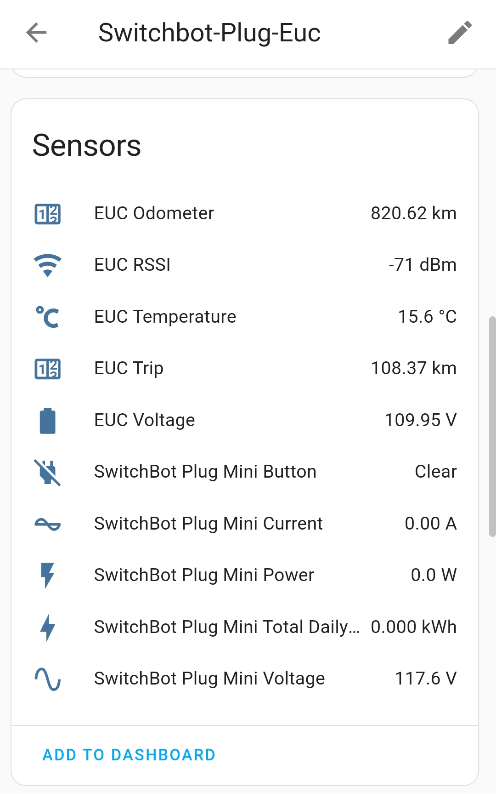

# Smartplug EUC Charge Control

This is an esphome-based firmware for ESP32 smartplugs (or any other ESP32 controlled relays) to control the charging of EUCs, specifically to turn off charging when a certain voltage (state of charge) is reached, in order to prevent fully charging which is detrimental to battery longevity.

## Supported EUCs

This projects currently supports the following EUCs:

  * Veteran/Leaperkim
  * ... more can be added in the future (Veteran is the EUC type I have and was able to test on)

## How to use

Any ESP32-based smartplugs could be used with this firmware by adapting the provided `.yaml` file, however I recommend the SwitchBot Smart Plug Mini (W1901400/W1901401) because (as of now) the default firmware them can be replaced without requiring dissasembly with the help of the SwitchbOTA project (instructions here: https://github.com/kendallgoto/switchbota). Additionally the SwitchBot Smart Plug Mini also contains an energy monitoring sensor, so you can also see the current/power the charger uses at any time.




Steps to flash this on a SwitchBot Smart Plug Mini:
  * follow the instructions at https://github.com/kendallgoto/switchbota to replace the default firmware with Tasmota firmware
  * Install esphome on your computrer (`pip install esphome` if you have python installed)
  * create a file named `secrets.yaml` in the project directory, with the following content:
  ```
wifi_ssid: <your WiFi SSID name>
wifi_password: <your WiFi password>
euc_mac: <your EUC bluetooth MAC address>
  ```
  * uncomment the `webserver:` line if you're not planing to use Home Assistant (you can also comment out the `api:` section in that case)
  * compile the project using command: `esphome compile switchbot-plug-mini-esphome-euc.yml`. This will generate a `firmware.bin` file in the project sub-directory: `.esphome/build/switchbot-plug-euc/.pioenvs/switchbot-plug-euc/`
  * open the smartplug Tasmota web page by typing the smartplug IP address in the a browser, go to the firmware update option and flash the `firmware.bin` file created in the previous step
  * the smartplug should automatically connect to the EUC on reboot (make sure you disconnect your phone the EUC first if connected / close the EUC app). Adopt the smartplug in Home Assistant or go to the smartplug web page to configure the charge stop & start voltage thresholds. Charging starts automatically if the EUC battery voltage is below the start threshold and stop when it gets to / above the stop threshold. You can also manually start the smartplug or start it with a configurable time delay.

## Acknowledgements

* https://github.com/enaon/eucWatch - which I used to see how to decode the information inside the Veteran bluetooth packets
* https://gist.github.com/halomakes/8be3976a034ad32e37e9c3b315d25b64 - initial esphome template for the SwitchBot Smart Plug Mini
* https://github.com/kendallgoto/switchbota - for the OTA procedure for replacing the default SwitchBot Smart Plug Mini firmware
